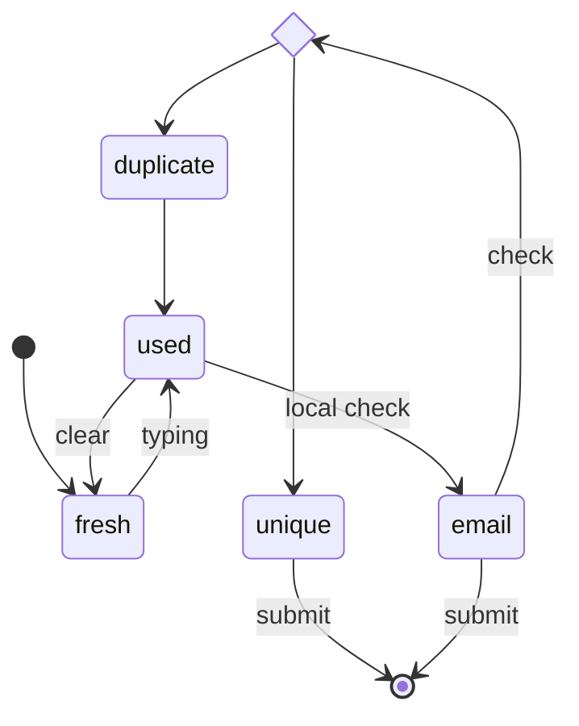

```mermaid
stateDiagram-v2
  state if_state <<choice>>

  [*] --> fresh
  fresh --> used: typing
  used --> fresh: clear
  used --> email: local check
  email --> if_state: check
  if_state --> unique
  if_state --> duplicate
  duplicate --> used
  unique --> [*]: submit
  email --> [*]: submit
```